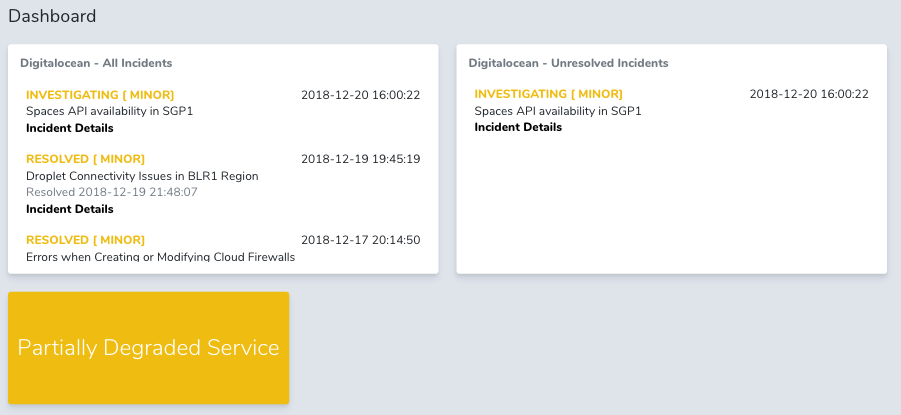

# Nova Digitalocean Card

[](https://packagist.org/packages/php-junior/nova-digitalocean-card)
[](https://packagist.org/packages/php-junior/nova-digitalocean-card)



## Installation

You can install the package in to a Laravel app that uses [Nova](https://nova.laravel.com) via composer:

```bash
composer require php-junior/nova-digitalocean-card
```

## Usage
```php
return [
    new \PhpJunior\NovaDigitaloceanCard\DigitaloceanIncidentsCard(),
    new \PhpJunior\NovaDigitaloceanCard\DigitaloceanUnresolvedIncidentsCard(),
    new \PhpJunior\NovaDigitaloceanCard\DigitaloceanStatusCard(),
];
```

## License

The MIT License (MIT). Please see [License File](LICENSE.md) for more information.
